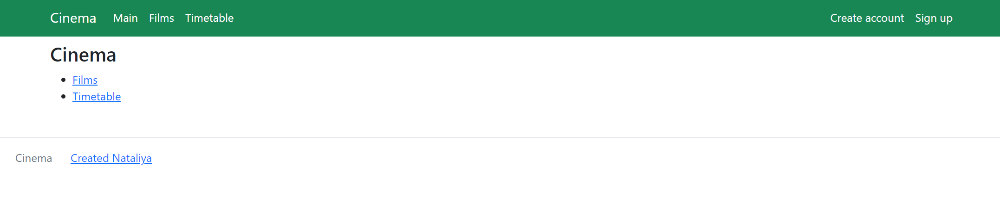

# job4j_cinema

+ [Project description](#Project-description)
+ [Technology stack](#Technology-stack)
+ [Environment requirements](#Environment-requirements)
+ [How to run the application](#How-to-run-the-application)
+ [How to stop the application](#How-to-stop-the-application)
+ [Application interaction](#Application-interaction)
____
### Project description

Service for buying tickets to the cinema. The service contains:
1) Registration and login of the user;
2) List of films and schedule of film sessions;
3) Choosing a film session and buying tickets.

Separation of rights: All users have the right to view the film list and film timetable;
Only registered users can buy tickets. If the user is not registered and clicks on the "Buy the ticket" button, then he is redirected to the login page.

### Technology stack

* Java 17
* PostgreSQL 14.5
* Spring Boot 2.7.6
* Thymeleaf
* Liquibase 4.15.0
* Checkstyle Plugin 3.1.2

### Environment requirements

* Java 17
* Apache Maven 3.8.6
* PostgreSQL 14.5
* Git (If you will use the `git clone` command in the first paragraph [How to run the application](#How-to-run-the-application))

### How to run the application

1. Use the command in console:

   `git clone https://github.com/nataliya-nataliya/job4j_cinema.git`

   or download project: [Download Zip](https://github.com/nataliya-nataliya/job4j_cinema/archive/refs/heads/main.zip)
2. Create database:
   `create database cinema;`
3. Specify the username and password from DBMS PostgreSQL in the file [application.properties](src/main/resources/application.properties) and [liquibase.properties](db/liquibase.properties)
4. Run all scripts from the folder: [db/scripts/](db/scripts)
5. Use the command in console to run:
   `mvn spring-boot:run`
6. Navigate to http://localhost:8080/index in a browser

### How to stop the application
Use console and press the keys:
`Ctrl + C` or `Ctrl + Break` or `Ctrl + Z`

### Application interaction
1. Main page:
   
____
2. Login page
   
____
3. Registration page
   
____
4. Film list page
   
____
5. Film session list page
   
____
6. Buying ticket page
   
____
7. Ticket page
   
____
8. Error taken seat page
   
